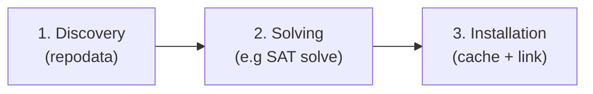

# Chapter 1: What Is a Package Manager?

Before we start coding, let's explore what a package manager does
and how the concepts map to the [conda] ecosystem we're building on.

## Universal concepts

Across most ecosystems ([npm], [pip], [cargo][cargo-book], conda), every package manager shares a
handful of ideas. This was never clear to me when starting to work on packaging, but makes a lot of sense in hindsight:

**Versions.** Every package has a version. [Semantic versioning][semver] (major.minor.patch)
is commonly used but not universal. [conda] uses its own version ordering that is
compatible with semver but also handles more, like pre-release suffixes
and post-release tags. See [cep-33] for more information.

**Requirements.** A requirement (also called a constraint, dependency, or spec)
expresses "I need library X, version >= 2.0". The format varies by ecosystem:
npm uses semver ranges, pip uses [PEP 508], and conda uses [**MatchSpecs**][cep-29]
like `lua >=5.4`. Cargo also has its own format, this is where ecosystems do differ a lot.

[cep-29]: https://conda.org/learn/ceps/cep-0029/
[cep-33]: https://conda.org/learn/ceps/cep-0033/

**Package artifacts.** A package is a distributable unit: a tarball, wheel, .conda
archive, crate, or .deb. It contains the code (compiled or not), metadata (name, version,
dependencies).

**An index.** The package manager needs somewhere to look up what's available:

- npm: the npm registry at `registry.npmjs.org`
- pip: [PyPI] at `pypi.org/simple/`
- cargo: [crates.io] at `index.crates.io`
- [conda]: **channels**, e.g. `conda.anaconda.org/conda-forge/`, each publishing a per-platform catalog called **repodata**

You'll find these four concepts in every ecosystem. The differences lie in how
each system implements them and what trade-offs it makes.

## The three steps

Every install operation walks through a pipeline of three steps:

### 1. Discovery: what exists?

Say someone has written a library called `moonshine`.  You want to use it.  How does
your tool know that `moonshine` exists, what version it is, and where to download
it?

For the conda ecosystem the answer is a **channel** or **registry** (npm/cargo
terminology) or **index** (pip terminology): a server that publishes a catalog of
available packages.  The catalog, again in conda, is called the **repodata**.

<ul>
  <li class="dir">Channel: https://conda.anaconda.org/conda-forge/
    <ul>
      <li class="dir">linux-64/
        <ul>
          <li class="file">repodata.json catalog for 64-bit Linux packages</li>
        </ul>
      </li>
      <li class="dir">noarch/
        <ul>
          <li class="file">repodata.json catalog for architecture-independent packages</li>
        </ul>
      </li>
    </ul>
  </li>
</ul>

`repodata.json` is a *really* large JSON file (which can exceed 350 MB for large channels like conda-forge) that lists
every package, every version of every package, and the dependencies of each
version. Later on you'll see that conda eventually outgrew this format and switched to a format that does not need
to be downloaded all at once. Other ecosystems also had a transition like this at some point.

### 2. Solving: which versions are compatible?

You request:

  1. I want `lua >=5.4` and `luarocks *`.  
  2. ...but `luarocks` depends on `lua >=5.1,<5.5` 
  3. and your favorite library depends on `lua =5.4.*`.  

Which exact versions should be installed?

This is a **dependency solving** problem.  When a package manager enforces
that only one version of each package can be installed at a time, the problem is
NP-complete.

Why is this NP-complete?

Russ Cox [proves this][vsat] by reducing [3-SAT] to package
version selection: each boolean variable becomes a package with two versions,
each clause becomes a package whose versions depend on the corresponding
literals, and a root package depends on all clause packages.  If the root is
installable, the formula is satisfiable.

Not every package manager hits this complexity.  If you allow multiple versions
of the same package to coexist (as [Nix] and [Go modules] do), you can install
everything the dependency graph asks for and the problem becomes much simpler. In our case, the
hardness comes from the "exactly one version" constraint.  [conda] enforces that
constraint, so a SAT solver is pretty appropriate.

In practice, real package ecosystems have enough structure that modern SAT
heuristics solve them quickly, in most cases.  We'll use [rattler]'s solver implementation, which is backed by
[resolvo], a pure-Rust SAT solver written by the prefix.dev team.

[vsat]: https://research.swtch.com/version-sat
[3-SAT]: https://en.wikipedia.org/wiki/Boolean_satisfiability_problem#3-satisfiability
[resolvo]: https://github.com/mamba-org/resolvo
[npm]: https://www.npmjs.com
[pip]: https://pip.pypa.io
[cargo-book]: https://doc.rust-lang.org/cargo/
[semver]: https://semver.org
[PEP 508]: https://peps.python.org/pep-0508/
[PyPI]: https://pypi.org
[crates.io]: https://crates.io
[Nix]: https://nixos.org
[Go modules]: https://go.dev/ref/mod
[wheels]: https://packaging.python.org/en/latest/specifications/binary-distribution-format/
[cep-35]: https://conda.org/learn/ceps/cep-0035/

### 3. Installation: getting packages onto disk

Once you know *which* packages to install, you have to download and unpack them.
These are some of the things we thought about when making [rattler]:

- **Caching**: if you've downloaded `lua-5.4.7` before, don't download it again.
- **Deduplication**: if ten projects all use `lua-5.4.7`, [rattler]'s approach is: store it once on disk
  and link (reflink, hardlink, etc.) it into each project's environment.
- **Transactive installation**: if the install fails halfway through, don't leave the environment
  in a broken half-installed state. Rattler has structs to handle this.
- **Linking**: Ref-linking is the most efficient but not always available.
- **Windows vs Unix**: Windows often-times needs different handling of things. For example opening/closing files is much slower. We wanted really good Windows support for rattler, and I think we have it.

## What we will build

`moonshot` will be a very minimal Lua package manager that we're building on top of [rattler].

These are the basic commands we will be creating in moonshot.

| Command | What it does | Steps involved |
|---|---|---|
| `init` | Create a project manifest | (none, just writes a file) |
| `search` | Query a channel for packages | Discovery |
| `install` | Fetch, solve, and install | Discovery, Solving, Installation |
| `lock` | Resolve dependencies and write the lock file | Discovery, Solving |
| `add` | Add a dependency to the manifest | (none, edits manifest) |
| `shell-hook` | Activate the environment | (post-installation) |
| `run` | Run a command inside the environment | (post-installation) |
| `build` | Create a new `.conda` package | (package creation) |

We'll implement each of these commands in its own chapter in Part I.

## The conda file format

A [conda] package is an archive.  Historically it was a `.tar.bz2` file, but the
modern [`.conda` format][cep-35] (version 2) is an uncompressed ZIP that contains:

<ul>
  <li class="file">moonshine-0.3.0-lua_0.conda
    <ul>
      <li class="file">metadata.json {"conda_pkg_format_version": 2}</li>
      <li class="file">pkg-moonshine-….tar.zst payload files</li>
      <li class="file">info-moonshine-….tar.zst info/index.json, info/paths.json, …</li>
    </ul>
  </li>
</ul>

The payload and metadata live in separate inner archives, so we can read the
metadata without unpacking the (potentially large) payload.

Using ZIP as the outer container is a relatively common choice. The reason is that ZIP stores a central directory at the end of the file, which means a reader can seek directly to any inner entry without scanning from the beginning. This is the same reason [Python wheels][wheels] (`.whl`) are ZIP files: a tool can extract just the metadata entry without downloading or reading the full archive.

We'll see both of these inner archives in detail when we build the `shot build` command in [Chapter 10](ch10-build.md).

## What moonshot does *not* do

Let's keep `moonshot` intentionally minimal. It will not:

- **Upload to a public channel.** We build packages locally and index them as a local channel instead. Adding this would not be very hard as there are rattler crates to do this.
- **Handle C extensions.** Supporting compiled extensions means invoking a C compiler, linking against the right libraries, and producing platform-specific artifacts. Our build command targets pure Lua only. This would be more challenging, but the good thing about conda is that the compilers and native libraries are just there for you to start using.

Luajit

[LuaJIT] has an [ffi] interface that allows connecting to C libraries without compilation. Luajit is also available as a conda-forge dependency, see [here](https://prefix.dev/channels/conda-forge/packages/luajit).

[LuaJIT]: https://luajit.org/ 
[ffi]: https://luajit.org/ext_ffi.html

Moonshot will wire together all the major [rattler] subsystems:

| Subsystem | Crate | Role |
|---|---|---|
| Repodata gateway | [`rattler_repodata_gateway`] | Fetch & cache channel metadata |
| Virtual packages | [`rattler_virtual_packages`] | Probe host system capabilities |
| Solver | [`rattler_solve`] | Pick and solve package versions |
| Installer | [`rattler`][rattler] | Download, extract, link |
| Shell activation | [`rattler_shell`] | Generate activation scripts |
| Lock files | [`rattler_lock`] | Persist exact solve results |

These are just the crates moonshot uses directly. The full [rattler] project
contains some more crates: see [Overview of the rattler crates](deep-dive-crate-ecosystem.md)
for the complete picture.

## Summary

- Every package manager shares four concepts: versions, requirements, artifacts,
  and an index.
- Installing packages is usually some form of the pipeline: discovery, solving, installation.
- [conda] is a platform-first, hermetic environment system with support for multipe programming languages.
- [rattler] implements the neccesities to work with the [conda] ecosystem in pure Rust, providing library
  crates for each subsystem.
- We'll use these crates to build `moonshot`.

[conda]: https://docs.conda.io
[rattler]: https://github.com/conda/rattler
[rattler_repodata_gateway]: https://crates.io/crates/rattler_repodata_gateway
[rattler_virtual_packages]: https://crates.io/crates/rattler_virtual_packages
[rattler_solve]: https://crates.io/crates/rattler_solve
[rattler_shell]: https://crates.io/crates/rattler_shell
[rattler_lock]: https://crates.io/crates/rattler_lock
[pixi]: https://pixi.sh
[rattler-build]: https://prefix.dev/docs/rattler-build/overview

In the next chapter we'll set up the Rust project and define the CLI structure.
