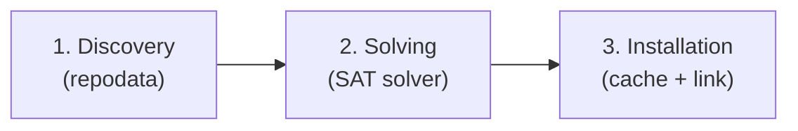

# Chapter 1: What Is a Package Manager?

Before writing a single line of Rust, let's agree on what a package manager does
and how the concepts map to the conda ecosystem we're building on.

## Universal concepts

Regardless of ecosystem ([npm], [pip], [cargo][cargo-book], conda), every package manager shares a
handful of ideas:

**Versions.** Every package has a version. [Semantic versioning][semver] (major.minor.patch)
is common but not universal. conda uses its own version ordering that is
compatible with semver but also handles four-part versions, pre-release suffixes,
and post-release tags.

**Requirements.** A requirement (also called a constraint, dependency, or spec)
expresses "I need library X, version >= 2.0". The format varies by ecosystem:
npm uses semver ranges, pip uses [PEP 508], and conda uses [**MatchSpecs**][cep-29]
like `lua >=5.4`.

[cep-29]: https://conda.org/learn/ceps/cep-0029/

**Package artifacts.** A package is a distributable unit: a tarball, wheel, .conda
archive, crate, or .deb. It contains the code, metadata (name, version,
dependencies), and sometimes pre-compiled binaries.

**An index.** The package manager needs somewhere to look up what's available:

- npm: the npm registry at `registry.npmjs.org`
- pip: [PyPI] at `pypi.org/simple/`
- cargo: [crates.io] at `index.crates.io`
- conda: **channels**, e.g. `conda.anaconda.org/conda-forge/`, each publishing a per-platform catalog called **repodata**

You'll find these four concepts in every ecosystem. The differences lie in how
each system implements them and what trade-offs it makes.

## The three steps

Every install operation walks through a pipeline of three steps:

### 1. Discovery: what exists?

Someone has written a library called `moonshine`.  You want to use it.  How does
your tool know that `moonshine` exists, what version it is, and where to download
it?

The answer is a **channel** (conda terminology) or **registry** (npm/cargo
terminology) or **index** (pip terminology): a server that publishes a catalog of
available packages.  The catalog is called **repodata** in conda.

<ul>
  <li class="dir">Channel: https://conda.anaconda.org/conda-forge/
    <ul>
      <li class="dir">linux-64/
        <ul>
          <li class="file">repodata.json catalog for 64-bit Linux packages</li>
        </ul>
      </li>
      <li class="dir">noarch/
        <ul>
          <li class="file">repodata.json catalog for architecture-independent packages</li>
        </ul>
      </li>
    </ul>
  </li>
</ul>

`repodata.json` is a large JSON file (often hundreds of megabytes) that lists
every package, every version of every package, and the dependencies of each
version.

### 2. Solving: which versions are compatible?

You ask for `lua >=5.4` and `luarocks *`.  But `luarocks` depends on
`lua >=5.1,<5.5` and your favorite library depends on `lua =5.4.*`.  Which exact
versions should be installed?

This is the **dependency solving** problem.  When a package manager enforces
that only one version of each package can be installed at a time, the problem is
NP-complete.

!!! note "Why is this NP-complete?"

    Russ Cox [proves this][vsat] by reducing [3-SAT] to package
    version selection: each boolean variable becomes a package with two versions,
    each clause becomes a package whose versions depend on the corresponding
    literals, and a root package depends on all clause packages.  If the root is
    installable, the formula is satisfiable.

Not every package manager hits this complexity.  If you allow multiple versions
of the same package to coexist (as [Nix] and [Go modules] do), you can install
everything the dependency graph asks for and the problem becomes much simpler. In our case, the
hardness comes from the "exactly one version" constraint.  conda enforces that
constraint, so we need a real solver.

In practice, real package ecosystems have enough structure that modern SAT
heuristics solve them quickly, in most cases.  We'll use rattler's solver implementation, which is backed by
[resolvo], a pure-Rust SAT solver written by the prefix.dev team.

[vsat]: https://research.swtch.com/version-sat
[3-SAT]: https://en.wikipedia.org/wiki/Boolean_satisfiability_problem#3-satisfiability
[resolvo]: https://github.com/mamba-org/resolvo
[npm]: https://www.npmjs.com
[pip]: https://pip.pypa.io
[cargo-book]: https://doc.rust-lang.org/cargo/
[semver]: https://semver.org
[PEP 508]: https://peps.python.org/pep-0508/
[PyPI]: https://pypi.org
[crates.io]: https://crates.io
[Nix]: https://nixos.org
[Go modules]: https://go.dev/ref/mod
[wheels]: https://packaging.python.org/en/latest/specifications/binary-distribution-format/
[cep-35]: https://conda.org/learn/ceps/cep-0035/

### 3. Installation: getting bits onto disk

Once you know *which* packages to install, you have to download and unpack them.
These are some of the things you need to think about:

- **Caching**: if you've downloaded `lua-5.4.7` before, don't download it again.
- **Deduplication**: if ten projects all use `lua-5.4.7`, rattler's approach is: store it once on disk
  and link (reflink, hardlink, etc.) it into each project's environment.
- **Transactive installation**: if the install fails halfway through, don't leave the environment
  in a broken half-installed state.
- **Platform differences**: Windows doesn't have POSIX hard links everywhere;
  macOS has a case-insensitive filesystem by default.

## What we're building

`moonshot` is the minimal Lua package manager we're building on top of rattler.
Here's how conda and rattler map to the universal concepts:

| Universal concept | conda / rattler term |
|---|---|
| Version | conda version string |
| Requirement | MatchSpec (`lua >=5.4`) |
| Artifact | `.conda` archive |
| Index | `repodata.json` per channel/subdir |

Each command in moonshot touches a different part of the pipeline:

| Command | What it does | Steps involved |
|---|---|---|
| `init` | Create a project manifest | (none, just writes a file) |
| `search` | Query a channel for packages | Discovery |
| `install` | Fetch, solve, and install | Discovery, Solving, Installation |
| `lock` | Resolve dependencies and write the lock file | Discovery, Solving |
| `add` | Add a dependency to the manifest | (none, edits manifest) |
| `shell` | Activate the environment | (post-installation) |
| `run` | Run a command inside the environment | (post-installation) |
| `build` | Create a new `.conda` package | (package creation) |

We'll implement each of these commands in its own chapter in Part I.

## The conda file format

A conda package is an archive.  Historically it was a `.tar.bz2` file, but the
modern [`.conda` format][cep-35] (version 2) is an uncompressed ZIP that contains:

<ul>
  <li class="file">moonshine-0.3.0-lua_0.conda
    <ul>
      <li class="file">metadata.json {"conda_pkg_format_version": 2}</li>
      <li class="file">pkg-moonshine-….tar.zst payload files</li>
      <li class="file">info-moonshine-….tar.zst info/index.json, info/paths.json, …</li>
    </ul>
  </li>
</ul>

The payload and metadata live in separate inner archives, so we can read the
metadata without unpacking the (potentially large) payload.

Using ZIP as the outer container is a common choice. ZIP stores a central directory at the end of the file, which means a reader can seek directly to any inner entry without scanning from the beginning. This is the same reason [Python wheels][wheels] (`.whl`) are ZIP files: a tool can extract just the metadata entry without downloading or reading the full archive.

We'll see both of these inner archives in detail when we build the `shot build` command in [Chapter 10](ch10-build.md).

## What moonshot does *not* do

We're keeping `moonshot` intentionally minimal.  It does not:

- **Upload to a public channel.** Publishing requires authentication, signing, and a trust model. We build packages locally and index them as a local channel instead.
- **Handle C extensions.** Supporting compiled extensions means invoking a C compiler, linking against the right libraries, and producing platform-specific artifacts. Our build command targets pure Lua only.

What it *does* do is wire together all the major rattler subsystems:

| Subsystem | Crate | Role |
|---|---|---|
| Repodata gateway | `rattler_repodata_gateway` | Fetch & cache channel metadata |
| Virtual packages | `rattler_virtual_packages` | Probe host system capabilities |
| Solver | `rattler_solve` | Pick consistent package versions |
| Installer | `rattler` | Download, extract, hard-link |
| Shell activation | `rattler_shell` | Generate activation scripts |
| Lock files | `rattler_lock` | Persist exact solve results |

These are just the crates moonshot uses directly.  The full rattler project
contains roughly 28 crates; see [Overview of the rattler crates](deep-dive-crate-ecosystem.md)
for the complete picture.

## Summary

- Every package manager shares four concepts: versions, requirements, artifacts,
  and an index.
- Installing packages is a three-step pipeline: discovery, solving, installation.
- conda is a platform-first, hermetic environment system with a well-defined file
  format.
- rattler implements the conda specification in pure Rust, providing library
  crates for each subsystem.
- We'll use all of them to build `moonshot`.

In the next chapter we'll set up the Rust project and define the CLI structure.
