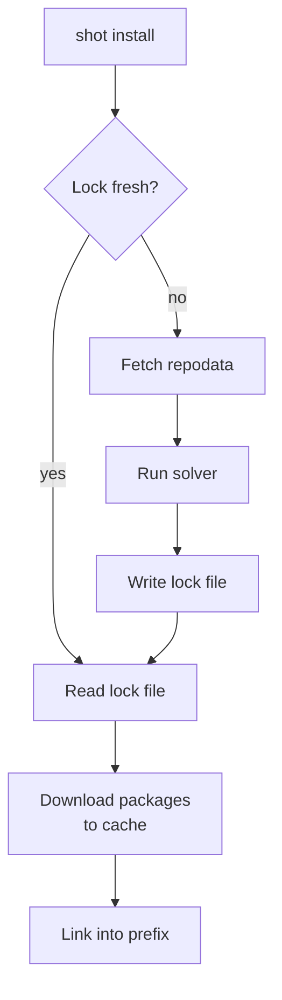

# Chapter 7: The `install` Command

<span class="newthought">Now we get to the heart</span> of moonshot: the install command. It reads the manifest,
checks the lock file, resolves if needed, and installs packages into a local
prefix. The lock file (produced by [Chapter 6](ch06-lock.md)'s `shot lock`) is
our source of truth: if it's fresh, `shot install` replays it without touching
the network or the solver.

## Design

`shot install` runs the full pipeline: check lock, resolve if stale, install.

```console
$ shot install
⠋ Fetching repodata
  1523 repodata records loaded
⠋ Solving
  Solved 5 packages in 0.3s
✔ Wrote moonshot.lock (5 packages)
  Downloading and extracting packages...
✔ Environment updated in 2.1s
  Activate with:  eval $(shot shell-hook)
```

When the lock is fresh, the resolve step is skipped entirely:

```console
$ shot install
  Downloading and extracting packages...
✔ Environment already up to date
```

You can pass an optional `--prefix` flag to override the install
location. By default, packages go into `.env/` relative to the
project root.

## Configuration

### The prefix directory

By convention, `moonshot` puts the environment at `.env/` relative to the
project root, alongside `moonshot.toml`.  This keeps the environment close to the
project and out of the user's global namespace. The user can override it with
`--prefix /path/to/env`. The `prefix_dir` helper and command module declarations
are defined in [Chapter 2](ch02-project-setup.md).

## Concepts: Installation

Here is the full pipeline that `shot install` runs:



### The package cache

Every package is first extracted into a *central cache* shared across all
environments on your machine (at `~/.rattler/pkgs/`).  The cache key is the
package's content hash, so `lua-5.4.7` is stored exactly once regardless of how
many environments use it. Content-addressed keys (rather than name-plus-version) prevent collisions when the same version is rebuilt with a different build string. Two builds of `lua-5.4.7` with different compiler flags get different hashes and coexist safely in the cache.

### Hard links and reflinks

<details class="margin-note" markdown>
<summary>Why hard-linking is safe</summary>

Packages in the cache are immutable after extraction. No tool or environment
modifies them in place. This invariant is what makes hard-linking safe:
multiple environments can share the same inodes because nobody writes to
them.
</details>

From the cache, files are linked into the target prefix. If possible on the system,
[rattler] uses **reflinks** (copy-on-write clones) when the filesystem supports
them (APFS on macOS, Btrfs and XFS on Linux). A reflink shares the underlying
data blocks without sharing the inode, so writing to one copy doesn't affect
the other. On filesystems without reflink support, [rattler] falls back to
**hard links**, which are a second directory entry pointing to the same inode.
If hard links are also unavailable (some network filesystems, Windows
cross-volume), it copies the file.

This means:

- An environment takes almost no disk space for packages that are already cached.
- Creating a new environment is fast (linking is cheap).

### Transactions

<details class="margin-note" markdown>
<summary>Partial installs</summary>

A naive package manager that unpacks files one by one can leave an
environment half-installed if the process is interrupted. Partial installs
are one of the most common failure modes in package management and often
require manual cleanup.
</details>

The Installer computes a **transaction**, a diff between the currently-installed
state and the desired state, and applies only the changes:

- Install packages not currently present
- Remove packages no longer needed
- Update packages whose version changed

This makes `shot install` idempotent: running it twice with the same manifest
is a no-op.

<details class="margin-note" markdown>
<summary>Deep dive</summary>

For a detailed look at the .conda archive format, inner archives, and
content-addressed storage, see [Deep Dive: The conda Package Format](deep-dive-package-format.md).
</details>

## Implementation

### Session install methods

Now that we have the resolve pipeline in `Session`, we can add methods that
handle the installation side. These live in `src/session.rs` alongside the
resolve logic:

``` {.rust file=src/session.rs}
<<session-install-packages>>
<<session-resolve-and-install>>
```

#### `install_packages`

This method takes a solved set of packages and links them into a prefix.
It scans the prefix for already-installed packages (to compute a minimal
transaction) and runs the `Installer` with progress bars.

``` {.rust #session-install-packages}
impl Session {
    /// Install a set of solved packages into the given prefix.
    pub async fn install_packages(
        &self,
        prefix: &std::path::Path,
        solution: Vec<RepoDataRecord>,
        platform: Platform,
    ) -> miette::Result<()> {
        let specs = self.project.manifest.match_specs()?;

        let installed_packages =
            PrefixRecord::collect_from_prefix::<PrefixRecord>(prefix).into_diagnostic()?;

        let start_install = Instant::now();
        let result = Installer::new()
            .with_download_client(self.client.clone())
            .with_target_platform(platform)
            .with_installed_packages(installed_packages)
            .with_execute_link_scripts(true)
            .with_requested_specs(specs)
            .with_reporter(IndicatifReporter::builder().finish())
            .install(prefix, solution)
            .await
            .into_diagnostic()
            .context("installing packages")?;

        if result.transaction.operations.is_empty() {
            println!(
                "{} Environment already up to date",
                console::style("✔").green()
            );
        } else {
            println!(
                "{} Environment updated in {:.1}s",
                console::style("✔").green(),
                start_install.elapsed().as_secs_f64()
            );
            println!("  Activate with:  eval $(shot shell-hook)");
        }

        Ok(())
    }
```

The installer needs to know which packages you *directly* requested (as opposed
to transitive dependencies) via `with_requested_specs`. It records this in the
`conda-meta/*.json` files so that future updates can correctly distinguish
"you asked for this" from "installed because something else needed it".

<details class="margin-note" markdown>
<summary>Tracking direct vs transitive</summary>

This distinction drives automatic cleanup: when a direct dependency is
removed, the installer can garbage-collect its transitive dependencies that
nothing else needs. Both [npm] and [pip] added this tracking late in their
development, and the lack of it caused years of accumulated orphan packages
in user environments.
</details>

`IndicatifReporter` is a [rattler]-provided reporter backed by [indicatif] that shows per-package
progress bars during download and extraction. If you want custom progress
display, you can implement your own; it's a trait, not a concrete type.

Setting `with_execute_link_scripts(true)` tells the installer to run conda's
**link scripts** after installation. These are scripts in
`<prefix>/etc/conda/activate.d/` that some packages use to set up post-install
configuration (updating `LUA_PATH`, for example).

#### `resolve_and_install`

This method resolves and installs in one step, without writing a lock file.
We'll reuse it in the build command ([Chapter 10](ch10-build.md)) to install
build-time dependencies into a temporary prefix.

``` {.rust #session-resolve-and-install}
    /// Resolve and install in one step, without writing a lock file.
    pub async fn resolve_and_install(
        &self,
        prefix: std::path::PathBuf,
    ) -> miette::Result<Vec<RepoDataRecord>> {
        let (solution, _channels, platform) = self.resolve(vec![]).await?;
        let result = solution.clone();
        self.install_packages(&prefix, solution, platform).await?;
        Ok(result)
    }
}
```

### `src/commands/install.rs`

Here is the full file skeleton, with each section defined as we encounter it:

``` {.rust file=src/commands/install.rs}
<<install-imports>>
<<install-args>>
<<install-execute>>
```

#### Imports

``` {.rust #install-imports}
use clap::Parser;
use fs_err as fs;
use miette::{Context, IntoDiagnostic};

use crate::lock::LOCK_FILENAME;
use crate::project::Project;
use crate::session::{ResolveStatus, Session};
```

The imports are much lighter now: the install command delegates to `Session`
for both resolving and installing.

#### Args

``` {.rust #install-args}
#[derive(Debug, Parser)]
pub struct Args {
    /// Override the target prefix (where packages are installed).
    ///
    /// Defaults to `.env/` relative to the project root.
    #[clap(long)]
    pub prefix: Option<std::path::PathBuf>,
}
```

#### The execute function

The `execute` function is our entry point for `shot install`. It uses
`Session::ensure_resolved` to check the lock file and resolve if needed,
then calls `install_packages` to link everything into the prefix.

``` {.rust #install-execute}
pub async fn execute(args: Args) -> miette::Result<()> {
    let project = Project::discover()?;
    let session = Session::new(project)?;

    let prefix = args
        .prefix
        .unwrap_or_else(|| session.project.default_prefix());
    fs::create_dir_all(&prefix)
        .into_diagnostic()
        .context("creating prefix directory")?;
    let prefix = std::path::absolute(prefix).into_diagnostic()?;

    let status = session.ensure_resolved(false).await?;

    match &status {
        ResolveStatus::AlreadyFresh(_) => {}
        ResolveStatus::Resolved { solution, .. } => {
            println!(
                "{} Wrote {} ({} packages)",
                console::style("✔").green(),
                LOCK_FILENAME,
                console::style(solution.len()).cyan()
            );
        }
    }

    let platform = rattler_conda_types::Platform::current();
    session
        .install_packages(&prefix, status.into_solution(), platform)
        .await
}
```

If the lock is fresh, `ensure_resolved` returns `AlreadyFresh` and the solver
is never invoked. If the lock is stale or missing, it resolves, writes the new
lock, and returns the solution. Either way, `install_packages` links the
packages into the prefix.

## Running `shot install`

```console
$ shot install
⠋ Fetching repodata
  1523 repodata records loaded
⠋ Solving
  Solved 5 packages in 0.3s
✔ Wrote moonshot.lock (5 packages)
  Downloading and extracting packages...
✔ Environment updated in 2.1s
  Activate with:  eval $(shot shell-hook)
```

Try it right away:

```console
$ shot run lua -e 'print(_VERSION)'
Lua 5.4
```

The Lua interpreter was fetched from conda-forge, unpacked, cached, and linked
into `.env/bin/`. We can run it without activating the shell because `shot run`
sets up the environment automatically (we'll build that in [Chapter 9](ch09-run.md)).

### What gets installed where

After `shot install`, the prefix looks like this:

<div class="file-tree">
<ul>
  <li class="dir"><span class="name">.env/</span>
    <ul>
      <li class="dir"><span class="name">bin/</span>
        <ul>
          <li class="file"><span class="name">lua</span> <span class="comment">the Lua interpreter</span></li>
          <li class="file"><span class="name">luarocks</span> <span class="comment">LuaRocks (if installed)</span></li>
        </ul>
      </li>
      <li class="dir"><span class="name">lib/</span>
        <ul>
          <li class="file"><span class="name">liblua.so.5.4</span></li>
          <li class="file"><span class="name">…</span></li>
        </ul>
      </li>
      <li class="dir"><span class="name">share/</span>
        <ul>
          <li class="dir"><span class="name">lua/5.4/</span>
            <ul>
              <li class="file"><span class="name">…</span> <span class="comment">pure-Lua libraries</span></li>
            </ul>
          </li>
        </ul>
      </li>
      <li class="dir"><span class="name">conda-meta/</span>
        <ul>
          <li class="file"><span class="name">lua-5.4.7-h5eee18b_0.json</span></li>
          <li class="file"><span class="name">…</span> <span class="comment">one file per installed package</span></li>
        </ul>
      </li>
    </ul>
  </li>
</ul>
</div>

The `conda-meta/` directory is [rattler]'s installation database.  Each JSON
file records the package name, version, build, all installed files, and their
hashes. You can inspect these to see exactly what's in your environment.

## Exercises

!!! exercise-easy "List Installed Packages"

    Add a `shot list` command that reads the installed prefix and lists all packages. Use `PrefixRecord::collect_from_prefix` to discover installed packages, then display each one's name, version, and build string.

    <details class="margin-note" markdown>
    <summary>Hint</summary>

    Use `PrefixRecord::collect_from_prefix` to list what is installed. Package fields live under `record.repodata_record.package_record`. Create a new command file and register it in `mod.rs` and `main.rs`.
    </details>

    Acceptance criteria
    :   - `shot list` prints all installed packages sorted alphabetically
        - If `.env/` does not exist, prints "No environment found. Run `shot install` first."
        - Total count printed at the end

!!! exercise-intermediate "Dry-Run Installation"

    Add a `--dry-run` flag to `shot install` that resolves dependencies and shows what would be installed without actually downloading or linking anything. Compare the resolved packages against what is already in the prefix (via `PrefixRecord::collect_from_prefix`) and report what would be added, updated, or unchanged.

    <details class="margin-note" markdown>
    <summary>Hint</summary>

    Resolve to get the solution, then compare against what is already in the prefix. The `size` field on `PackageRecord` is optional. Short-circuit before `install_packages` to avoid any downloads.
    </details>

    Acceptance criteria
    :   - `shot install --dry-run` shows packages that would be installed with their versions and sizes
        - Already-installed packages are listed as "unchanged" or "update from X to Y"
        - No files are downloaded or written to the prefix
        - Exit code 0 on success

!!! exercise-hard "Reinstall Command"

    Implement `shot reinstall` that removes the existing environment prefix and re-installs everything from the lock file. This forces a clean install, useful when the prefix is corrupted or when switching platforms. Read the lock file, remove the prefix directory, then run the full install pipeline. Add a `--relock` flag that also re-resolves before installing.

    <details class="margin-note" markdown>
    <summary>Hint</summary>

    Remove the prefix with `remove_dir_all`, then read the lock file and call `Session::install_packages` to reinstall. For `--relock`, call `ensure_resolved(true)` first. Create `src/commands/reinstall.rs` (or add a flag to `install.rs`) and register it in `src/main.rs`.
    </details>

    Acceptance criteria
    :   - `shot reinstall` removes `.env/`, reads the lock file, and installs all locked packages fresh
        - If no lock file exists, it resolves first then installs
        - `shot reinstall --relock` forces re-resolution before installing
        - Progress output shows the full install (downloading + linking)
        - After reinstall, `shot list` shows the same packages as before

## Summary

- The install command checks the lock file before doing any work.
- If the lock is fresh, packages are installed directly from it (no solver,
  no network).
- If the lock is stale or missing, `Session::ensure_resolved` runs the full
  pipeline and the result is written to `moonshot.lock` before installation.
- The `Installer` computes a transaction (diff) and applies only the changes.
- Files are linked from the central cache into the prefix, using reflinks
  where available and falling back to hard links or copies.
- `Session::resolve_and_install` provides a one-call interface for the build
  command.

In the next chapter we set up shell hooks, which generate activation
scripts so you can use the installed packages.

[rattler]: https://github.com/conda/rattler
[npm]: https://www.npmjs.com
[pip]: https://pip.pypa.io
[indicatif]: https://crates.io/crates/indicatif
