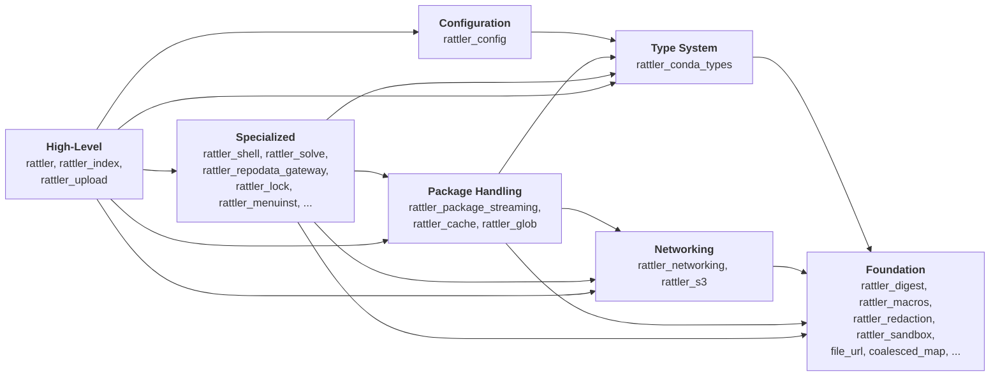

# Overview of the `rattler` crates

rattler is split into roughly 28 Rust crates. This chapter will list all of them,
shows how they depend on each other, and traces how the project grew over time.

## Why so many crates?

[pixi] uses rattler to manage environments, [rattler-build] uses it to construct packages, 
and standalone tools cherry-pick individual capabilities like lock-file parsing or repodata
fetching.  By splitting functionality into focused crates, each consumer can
depend on exactly the parts it needs, keeping compile times and binary sizes
under control.
Splitting into crates also enforces API boundaries.  When solving, networking,
and package I/O live in separate crates, they *cannot* reach into each other's
internals.  And in large Rust projects, smaller crates mean faster incremental
builds.

[pixi]: https://pixi.sh
[rattler-build]: https://prefix-dev.github.io/rattler-build

## Dependency diagram

The diagram below shows the seven tiers and how they depend on each other.
Arrows point from a tier to the tiers it depends on.  Per-crate dependencies
are listed in the reference table further down.

## Crates by tier

### Foundation

These crates have no dependencies on other rattler crates.

1. **[`rattler_digest`](https://crates.io/crates/rattler_digest)** -- Thin wrappers around SHA-256 and MD5 hashing. Every conda package carries checksums, and this crate gives the rest of rattler a uniform way to compute and compare them.
1. **[`rattler_macros`](https://crates.io/crates/rattler_macros)** -- Proc-macros for writing version specs and package names as compile-time checked literals, e.g. `package_name!("python")`. Invalid specs cause a compile error instead of a runtime panic.
1. **[`rattler_redaction`](https://crates.io/crates/rattler_redaction)** -- Strips tokens, passwords, and other secrets from URLs before they appear in log output. Crates like `rattler_repodata_gateway` and `rattler_cache` depend on it.
1. **[`rattler_pty`](https://crates.io/crates/rattler_pty)** -- Allocates pseudo-terminals for interactive child processes. pixi's `shell` command uses it.
1. **[`rattler_libsolv_c`](https://crates.io/crates/rattler_libsolv_c)** -- Safe Rust bindings to the C [libsolv](https://github.com/openSUSE/libsolv) library. Used by `rattler_solve` as one of its solver backends, alongside the pure-Rust resolvo solver.
1. **[`file_url`](https://crates.io/crates/file_url)** -- Converts between file-system paths and `file://` URLs, handling platform quirks (drive letters on Windows, UNC paths, etc.).
1. **[`path_resolver`](https://crates.io/crates/path_resolver)** -- Locates standard config/cache/data directories per OS conventions: XDG on Linux, `Library` on macOS, `AppData` on Windows.
1. **[`simple_spawn_blocking`](https://crates.io/crates/simple_spawn_blocking)** -- Runs blocking child processes from async code. When you need to run an external command from inside a tokio runtime, this crate handles the thread-pool dispatch.
1. **[`coalesced_map`](https://crates.io/crates/coalesced_map)** -- Concurrent data structure that deduplicates simultaneous lookups for the same key. This reduces redundant work in hot paths like repodata fetching.
1. **[`rattler_sandbox`](https://crates.io/crates/rattler_sandbox)** -- Restricts what a child process can access on the host system. Uses `birdcage` under the hood (seatbelt profiles on macOS, user namespaces on Linux).

### Type system

1. **[`rattler_conda_types`](https://crates.io/crates/rattler_conda_types)** -- The most depended-on crate in the project. Defines the core data model: `Version`, `VersionSpec`, `MatchSpec`, `PackageRecord`, `RepoDataRecord`, `Platform`, `Channel`, and many more. Intentionally kept free of I/O and networking; it is pure data types and parsing logic, which makes it easy to compile for WASM targets. Depends on `rattler_digest`, `rattler_macros`.

### Networking

1. **[`rattler_networking`](https://crates.io/crates/rattler_networking)** -- Authentication middleware (token-based, Bearer, HTTP Basic), retry policies, and download progress reporting. Wraps `reqwest` with a `reqwest_middleware` chain. See the [Networking deep dive](deep-dive-networking.md).
1. **[`rattler_s3`](https://crates.io/crates/rattler_s3)** -- S3-compatible object storage backend for channels. Translates conda channel URLs into S3 API calls so that channels can be hosted in AWS S3, MinIO, or other S3-compatible buckets. Depends on `rattler_networking`.

### Configuration

1. **[`rattler_config`](https://crates.io/crates/rattler_config)** -- Loads and merges settings from `.condarc` files, environment variables, and programmatic overrides into a single typed struct. The networking and repodata layers read their configuration from it. Depends on `rattler_conda_types`.

### Package handling

1. **[`rattler_package_streaming`](https://crates.io/crates/rattler_package_streaming)** -- Streaming extraction of `.conda` (ZIP-based) and `.tar.bz2` packages. Streaming means extraction can begin before the full download has finished. See the [Package Format deep dive](deep-dive-package-format.md). Depends on `rattler_conda_types`, `rattler_digest`.
1. **[`rattler_cache`](https://crates.io/crates/rattler_cache)** -- Manages the on-disk package cache. Handles concurrent extraction: when two environments both need the same package, only one extraction runs and the other waits. Also validates cached packages against their checksums. Depends on `rattler_conda_types`, `rattler_package_streaming`, `rattler_networking`.
1. **`rattler_glob`** -- Glob pattern matching for file selection tasks such as filtering package contents or specifying include/exclude patterns. Depends on `rattler_digest`.

### Specialized

1. **[`rattler_shell`](https://crates.io/crates/rattler_shell)** -- Generates shell activation scripts for bash, zsh, fish, cmd.exe, PowerShell, and Nushell. Given an environment, it produces the `PATH` and environment variable changes needed to activate it. Depends on `rattler_conda_types`.
1. **[`rattler_virtual_packages`](https://crates.io/crates/rattler_virtual_packages)** -- Detects virtual packages on the current system (`__linux`, `__osx`, `__glibc`, `__cuda`, `__archspec`). Solvers use these to ensure packages are compatible with the host. See the [Virtual Packages deep dive](deep-dive-virtual-packages.md). Depends on `rattler_conda_types`.
1. **[`rattler_solve`](https://crates.io/crates/rattler_solve)** -- Abstraction over dependency solvers. Ships two backends: [resolvo](deep-dive-resolvo.md) (a pure-Rust SAT solver for conda) and libsolv (via `rattler_libsolv_c`). Resolvo is the default. Depends on `rattler_conda_types`, `rattler_libsolv_c`.
1. **[`rattler_repodata_gateway`](https://crates.io/crates/rattler_repodata_gateway)** -- Fetches and caches `repodata.json`, the channel metadata that lists every available package. Handles JLAP incremental updates, `.zst` compressed downloads, and etag-based revalidation. Depends on `rattler_conda_types`, `rattler_networking`, `rattler_cache`, `rattler_digest`, `rattler_redaction`, `coalesced_map`.
1. **[`rattler_lock`](https://crates.io/crates/rattler_lock)** -- Reads and writes conda lock files. Lock files pin exact package versions and hashes across platforms so that environments can be recreated exactly. pixi and rattler-build both depend on it. Depends on `rattler_conda_types`, `rattler_digest`.
1. **[`rattler_menuinst`](https://crates.io/crates/rattler_menuinst)** -- Creates desktop menu entries and shortcuts for GUI applications, following the `menuinst` standard shared with the broader conda ecosystem. Works on Windows, macOS, and Linux. Depends on `rattler_conda_types`, `rattler_shell`.

### High-level

1. **[`rattler`](https://crates.io/crates/rattler)** -- The main library crate. Re-exports types from lower-level crates and provides functions for creating environments, installing packages, and managing transactions. Most tools that use rattler depend on this crate directly. Depends on `rattler_conda_types`, `rattler_cache`, `rattler_networking`, `rattler_shell`, `rattler_digest`, `rattler_package_streaming`, `rattler_menuinst`.
1. **[`rattler_index`](https://crates.io/crates/rattler_index)** -- Creates local channel indexes. Given a directory of `.conda` or `.tar.bz2` files, it extracts metadata and produces a `repodata.json`. Useful for testing and hosting private channels from a local directory. Depends on `rattler_conda_types`, `rattler_package_streaming`, `rattler_digest`, `rattler_networking`, `rattler_s3`.
1. **[`rattler_upload`](https://crates.io/crates/rattler_upload)** -- Pushes packages to [prefix.dev](https://prefix.dev), Quetz, or Artifactory. Depends on `rattler_networking`, `rattler_conda_types`, `rattler_config`, `rattler_package_streaming`.

## Project timeline

The rattler project started in **November 2021** with a single `rattler` crate,
an experiment in building conda tooling in Rust.

In **late 2022**, the first major split occurred: `rattler_conda_types` was
extracted to hold the core data model, and `rattler_package_streaming` was
created for streaming package extraction.

**Early 2023** saw rapid growth.  In the span of a few weeks, five new crates
appeared: `rattler_digest`, `rattler_repodata_gateway`, `rattler_solve`,
`rattler_shell`, and `rattler_virtual_packages`.  This was the period when
rattler became usable as a library, and pixi became its first major consumer.

Through **mid-to-late 2023**, the networking layer (`rattler_networking`), solver
bindings (`rattler_libsolv_c`), and lock file support (`rattler_lock`) were added,
filling in the pieces needed for full-featured environment management.

In **2024**, `file_url` and
`simple_spawn_blocking` handled cross-platform edge cases, `rattler_cache`
unified package cache management, and `rattler_redaction` improved security
logging.  Late in the year `rattler_sandbox` introduced sandboxed builds.

In **2025**, `rattler_menuinst` added
desktop integration, `rattler_pty` improved interactive shell support,
`rattler_config` unified configuration loading, `rattler_upload` enabled
direct package publishing, and `rattler_s3` opened up S3-compatible storage as
a channel backend.

The most recent addition is **`rattler_glob`** (January 2026), which adds glob
pattern matching.
