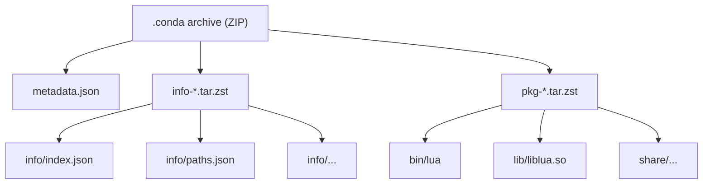

# Deep Dive: The conda Package Format

In [Chapter 10](ch10-build.md) we ran `shot build` and produced
`lumen-0.1.0-lua_0.conda`. What's inside that file? Let's crack it open:

```console
$ unzip -l output/noarch/lumen-0.1.0-lua_0.conda
Archive:  lumen-0.1.0-lua_0.conda
  Length      Date    Time    Name
---------  ---------- -----   ----
       33  2024-03-15 12:00   metadata.json
     1024  2024-03-15 12:00   pkg-lumen-0.1.0-lua_0.tar.zst
      512  2024-03-15 12:00   info-lumen-0.1.0-lua_0.tar.zst
```

Three files: a tiny JSON sentinel, and two zstd-compressed tar archives. The
`info-` archive contains package metadata (name, version, dependencies, file
hashes). The `pkg-` archive contains the actual files that get installed into
your environment. This separation means tools like the solver can read metadata
without ever downloading the payload.

This chapter is a precise reference for the full format. You don't need it to
build moonshot, but if you're debugging a packaging problem or writing tooling
that reads package archives, you'll want it.

## The two formats

### `.tar.bz2` (v1)

The original conda package format is a simple tar archive compressed with bzip2:

<div class="file-tree">
<ul>
  <li class="file"><span class="name">lua-5.4.7-h5eee18b_0.tar.bz2</span>
    <ul>
      <li class="file"><span class="name">bin/lua</span></li>
      <li class="file"><span class="name">lib/liblua.so.5.4</span></li>
      <li class="dir"><span class="name">info/</span>
        <ul>
          <li class="file"><span class="name">index.json</span></li>
          <li class="file"><span class="name">paths.json</span></li>
          <li class="file"><span class="name">files</span></li>
          <li class="file"><span class="name">hash_input.json</span></li>
          <li class="dir"><span class="name">test/</span></li>
        </ul>
      </li>
      <li class="file"><span class="name">…</span></li>
    </ul>
  </li>
</ul>
</div>

The entire archive must be decompressed sequentially before any file can be
accessed.  For large packages this is slow.

### `.conda` (v2)

The modern `.conda` format is an **uncompressed ZIP** containing three members:

<div class="file-tree">
<ul>
  <li class="file"><span class="name">lua-5.4.7-h5eee18b_0.conda</span>
    <ul>
      <li class="file"><span class="name">metadata.json</span> <span class="comment">uncompressed</span></li>
      <li class="file"><span class="name">pkg-lua-5.4.7-h5eee18b_0.tar.zst</span> <span class="comment">zstd-compressed tar</span></li>
      <li class="file"><span class="name">info-lua-5.4.7-h5eee18b_0.tar.zst</span> <span class="comment">zstd-compressed tar</span></li>
    </ul>
  </li>
</ul>
</div>

The outer ZIP is not compressed; the compression happens in the inner tars.
Because ZIP stores a central directory at the end of the file, a tool can read
that directory first and then jump straight to `info-*.tar.zst` without
downloading or reading the payload.

The nesting of a `.conda` archive looks like this:



The three members each serve a distinct purpose:

- **`metadata.json`** is a sentinel confirming this is a v2 package:

  ```json
  {"conda_pkg_format_version": 2}
  ```

- **`info-*.tar.zst`** contains only the `info/` files. Solvers, indexers, and
  search tools use this to read metadata without touching the payload.

- **`pkg-*.tar.zst`** contains the actual payload files. Installers that already
  have metadata can extract just this member.

## The `info/index.json`

Every tool in the conda ecosystem reads this file: the solver, the installer,
the indexer.

```json
{
  "name": "lua",
  "version": "5.4.7",
  "build": "h5eee18b_0",
  "build_number": 0,
  "subdir": "linux-64",
  "depends": [
    "libgcc-ng >=12"
  ],
  "constrains": [],
  "noarch": null,
  "license": "MIT",
  "timestamp": 1712345678000
}
```

### Key fields

| Field | Meaning |
|---|---|
| **name** | Lowercase, hyphens allowed, no spaces. |
| **version** | Conda's parser is more flexible than semver. `5.4.7`, `1.0.0a1`, `2024.01.02` are all valid. |
| **build** | Distinguishes same-version packages with different build options. Typically a hash of the build inputs. |
| **build_number** | Rebuild counter. The solver prefers higher values. |
| **subdir** | Target platform: `linux-64`, `osx-arm64`, `win-64`, `noarch`, etc. |
| **depends** | Runtime dependencies as MatchSpec strings. Enforced by the solver at install time. |
| **constrains** | Optional constraints on packages that are *not* dependencies. "If `old-library` is present, it must be `>=2.0`." |
| **noarch** | If `"generic"`, the package is platform-independent and lives in `noarch/`. |
| **timestamp** | Milliseconds since the Unix epoch. Tiebreaker when all other ordering criteria are equal. |

## The `info/paths.json`

```json
{
  "paths": [
    {
      "relative_path": "bin/lua",
      "path_type": "hardlink",
      "sha256": "abc123...",
      "size_in_bytes": 412672
    },
    {
      "relative_path": "bin/lua",
      "path_type": "softlink",
      "dest": "lua5.4"
    },
    ...
  ],
  "paths_version": 1
}
```

Every file in the package is listed here with its type and hash.  The installer
uses this to:

1. Verify downloaded archives haven't been corrupted.
2. Know which paths to hard-link from the cache into the prefix.
3. Know which paths to remove on uninstall.

### Path types

| Type | Meaning |
|---|---|
| **hardlink** | A regular file; will be hard-linked from cache |
| **softlink** | A symbolic link; the `dest` field gives the target |
| **directory** | An empty directory |

Note that most files are `hardlink` even if the original build used symlinks.
conda tools typically convert symlinks to hardlinks when packing to maximize
cache reuse across platforms.

## The `conda-meta/` installation record

When [rattler] installs a package, it writes a JSON file to
`<prefix>/conda-meta/<name>-<version>-<build>.json`:

```json
{
  "name": "lua",
  "version": "5.4.7",
  "build": "h5eee18b_0",
  "build_number": 0,
  "channel": "https://conda.anaconda.org/conda-forge/linux-64",
  "files": ["bin/lua", "lib/liblua.so.5.4", ...],
  "paths_data": { ... },
  "requested_spec": "lua >=5.4",
  "package_tarball_full_path": "/home/user/.rattler/pkgs/...",
  "extracted_package_dir": "/home/user/.rattler/pkgs/.../pkg"
}
```

This is the **prefix record**, rattler's `PrefixRecord` type.  It's used by:

- The solver (to know what's installed)
- The installer (to compute the transaction diff)
- Uninstall tools (to know which files to remove)

## Compression in the Rust ecosystem

The `.conda` format uses **[zstd]** ([Zstandard]) compression.  zstd was designed by
Yann Collet with a focus on very fast decompression at competitive
ratios.

The Rust ecosystem has mature crates for this:

```toml
zstd = "0.13"
```

rattler uses `zstd` through the [rattler_package_streaming] crate, which also
handles tar creation/extraction and the ZIP wrapper.

For comparison:

- `.tar.bz2`: bzip2 compression, high ratio, very slow (single-threaded)
- `.conda` inner tars: zstd, good ratio, very fast, parallel

The practical effect: a modern `.conda` package installs roughly 2-3x faster
than a `.tar.bz2` of equivalent content, because zstd decompression is
significantly faster and can use multiple cores.

## Streaming readers and writers

A key design pattern in [rattler]'s package streaming code is *streaming* I/O.
Instead of reading an entire archive into memory and then processing it, you
process it chunk by chunk:

```rust
// Conceptually (simplified)
let decoder = zstd::Decoder::new(reader)?;
let mut archive = tar::Archive::new(decoder);

for entry in archive.entries()? {
    let mut entry = entry?;
    // entry is a streaming reader: read it in chunks
    let path = entry.path()?;
    let mut dest_file = File::create(dest.join(path))?;
    std::io::copy(&mut entry, &mut dest_file)?;
}
```

The decompressor, tar parser, and file writer are chained together so that data
flows through in small chunks.  At no point does the entire archive reside in
memory.  This is how rattler can install a 500 MB package on a machine with only
256 MB RAM.

## Summary

- The `.conda` format is an uncompressed ZIP with two inner `tar.zst` archives:
  one for metadata, one for payload.
- `info/index.json` contains the package identity, version, and dependencies.
- `info/paths.json` lists every file with its SHA-256 hash.
- `conda-meta/` records what was installed and where it came from.
- zstd provides fast, parallel decompression.
- Streaming I/O avoids loading entire archives into memory.

[zstd]: https://docs.rs/zstd
[Zstandard]: https://facebook.github.io/zstd/
[rattler]: https://github.com/conda/rattler
[rattler_package_streaming]: https://crates.io/crates/rattler_package_streaming
