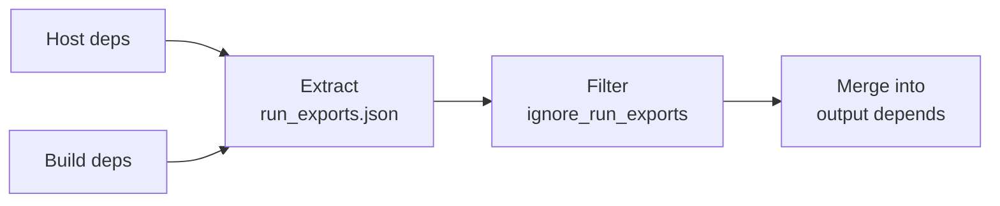

# Deep Dive: Run Exports

When you build a package against a library, the resulting package needs that
library at runtime too. Manually tracking which build dependencies should become
runtime dependencies is error-prone.

The `run_exports` mechanism automates this. A package declares which runtime
dependencies it contributes to any package that builds against it. The build
system reads these declarations and adds the corresponding entries to the output
package's `depends` list.

## Where run_exports live

Each package can include an `info/run_exports.json` file inside its `.conda`
archive. This file has five possible fields:

| Field | Meaning |
|---|---|
| **weak** | Added when the package appears as a **host** dependency |
| **strong** | Added when the package appears as a **host** or **build** dependency |
| **noarch** | Added only when the target package is `noarch` |
| **weak_constrains** | Like weak, but adds to `constrains` instead of `depends` |
| **strong_constrains** | Like strong, but adds to `constrains` instead of `depends` |

All five fields are lists of dependency strings. Most packages only use `weak`.

A minimal `run_exports.json` looks like this:

```json
{
  "weak": [
    "libpng >=1.6"
  ]
}
```

## Example 1: Weak exports (libpng)

libpng is a C library for reading and writing PNG images. Suppose you are
building an image editor that links against libpng 1.6.43. Your recipe lists
libpng as a **host** dependency because you link against it:

```yaml
requirements:
  host:
    - libpng 1.6.43
```

Inside the libpng 1.6.43 package, the `run_exports.json` contains:

```json
{
  "weak": [
    "libpng >=1.6.43,<1.7.0a0"
  ]
}
```

When the build system resolves your host dependencies, it extracts this file
from the installed libpng package. Because `weak` exports propagate from host
dependencies, the build system adds `libpng >=1.6.43,<1.7.0a0` to your output
package's `depends` list automatically. You never had to write it yourself.

Two things to note about weak exports:

- They only propagate from **host** dependencies. If libpng appeared as a build
  dependency instead, the weak export would be ignored.
- This distinction matters because host dependencies are libraries you link
  against at runtime, while build dependencies are tools like `cmake` or `make`.

Weak is the most common type. It covers the standard case: "if you link against
my library, you need a compatible version at runtime."

## Example 2: Strong exports (gcc)

Compilers are typically **build** dependencies. You need `gcc` to compile your
code, but you don't link against `gcc` itself at runtime. However, the compiler
inserts calls to its runtime library (`libgcc-ng`) into every binary it
produces. Your compiled code needs `libgcc-ng` even though you never listed it
as a dependency.

The gcc package declares a strong export:

```json
{
  "strong": [
    "libgcc-ng >=13"
  ]
}
```

Strong exports propagate from **both** host and build dependencies. Because gcc
sits in the build section:

```yaml
requirements:
  build:
    - gcc 13
  host:
    - libpng 1.6.43
```

the build system still picks up `libgcc-ng >=13` and adds it to the output
package's `depends`. A weak export would have been silently skipped here, since
gcc is not a host dependency. Strong exports exist precisely for this pattern:
build-time tools that inject runtime requirements.

The same logic applies to other compilers:

- The Fortran compiler `gfortran` contributes `libgfortran-ng` as a strong
  export.
- The C++ standard library follows a similar pattern through `libstdcxx-ng`.

## Example 3: Noarch exports (python)

Some packages are platform-independent. A pure-Python library with no C
extensions can be built once and installed on any platform. These packages are
marked `noarch: python` in their recipe, and they live in the `noarch/`
subdirectory of a channel.

Python itself declares a noarch export:

```json
{
  "noarch": [
    "python_abi 3.12.* *_cp312"
  ]
}
```

When a package is `noarch` and lists python as a host dependency, the build
system adds `python_abi 3.12.* *_cp312` to its runtime dependencies. This
constraint pins the package to a specific Python ABI, so the solver will not
install it alongside an incompatible Python version.

Why a separate field? If Python's ABI constraint were a regular `weak` export,
it would also apply to platform-specific packages that link against the Python
C API. Those packages already have their own explicit dependency on python. The
`noarch` field limits the export to packages that need ABI tracking without
native compilation artifacts.

## The constrains variants

The `weak_constrains` and `strong_constrains` fields work like their
counterparts, but they add entries to `constrains` instead of `depends`. A
constraint does not cause a package to be installed. It only says: "if this
package happens to be installed, it must satisfy this version range."

For example, a BLAS library might declare:

```json
{
  "weak_constrains": [
    "blas * *openblas"
  ]
}
```

This does not force `blas` into the environment. But if some other package
brings in `blas`, the constraint ensures the `openblas` variant is selected.
This prevents conflicts between BLAS implementations without adding unnecessary
dependencies.

## How rattler-build applies run_exports

When [rattler-build] processes a recipe, it follows these steps:



1. **Resolve and install** host and build dependencies into their respective
   prefixes.
2. **Extract** `run_exports.json` from each installed dependency. Weak exports
   are collected from host dependencies. Strong exports are collected from both
   host and build dependencies. Noarch exports are collected only if the output
   package is `noarch`.
3. **Filter** the collected exports through `ignore_run_exports` rules. A recipe
   can exclude specific exports by name or by the package they came from:

    ```yaml
    requirements:
      ignore_run_exports:
        by_name:
          - libpng
        from_package:
          - gcc
    ```

    `by_name` drops any export whose package name matches. `from_package` drops
    all exports contributed by the named package. This gives recipe authors an
    escape hatch when an export is wrong or unwanted.

4. **Merge** the surviving exports into the output package's `depends` and
   `constrains` lists, alongside any dependencies the recipe declared
   explicitly.

The output package's `info/index.json` ends up with all runtime dependencies:
both what the recipe author wrote explicitly and what the build dependencies
contributed through `run_exports`.

## Relation to moonshot

Moonshot skips `run_exports` entirely. It copies `[dependencies]` directly into
the package's runtime requirements. This works for Lua scripts that have no
compilation step.

Compiled languages need more care. `run_exports` are how the build system
prevents [ABI breakage][abi] across the dependency graph. When a library bumps
its soname, its `run_exports` version range changes, and every package rebuilt
against it automatically picks up the new constraint. Without this mechanism,
each downstream recipe would need manual updates. See [rattler-build] for a
full implementation.

[abi]: https://community.kde.org/Policies/Binary_Compatibility_Issues_With_C%2B%2B

[rattler-build]: https://github.com/prefix-dev/rattler-build
